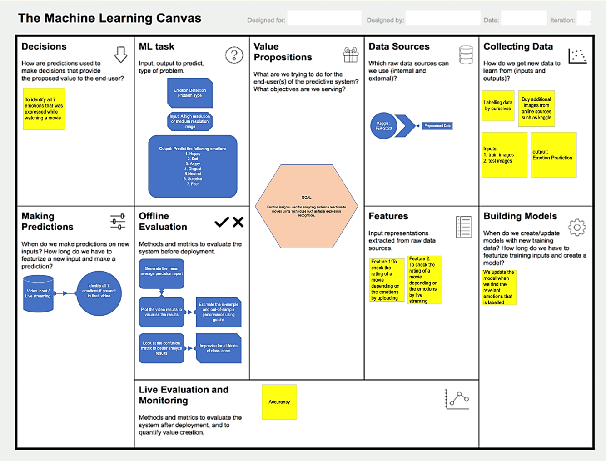
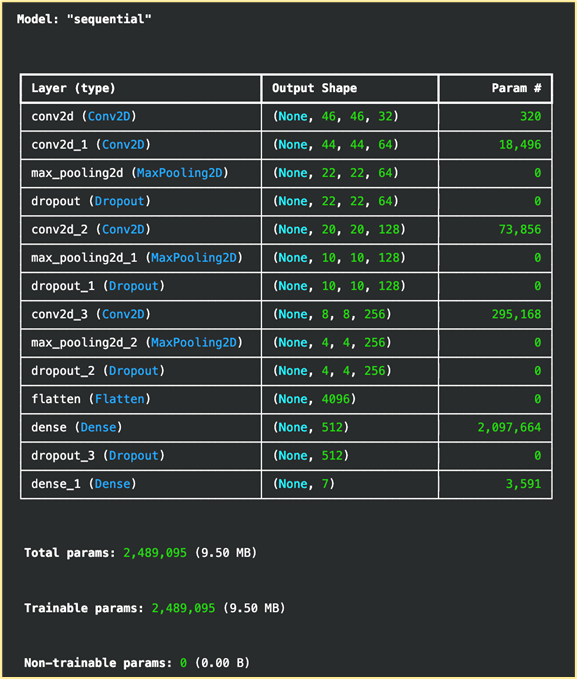
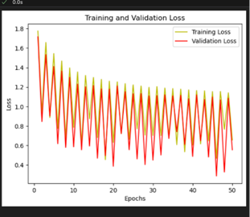
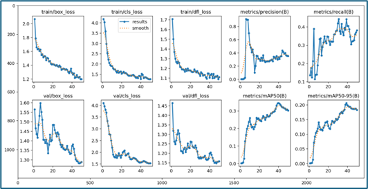
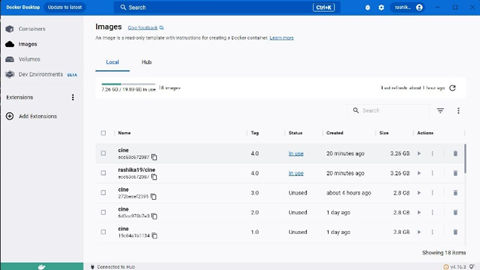

# CinePulse

## Title
CinePulse - Emotion-Based Movie Ranker (To find the real enjoyment index)

## Problem Statement
The major movie awards, including the Oscars, Berlinale, Venice Film Festival, Cannes Film Festival, and Toronto International Film Festival, play crucial roles in recognizing excellence, fostering global collaboration, and promoting artistic diversity in cinema. Traditionally, these awards relied on methods like voting and reviews, but criticisms of bias and scandals have prompted a decline in public trust. In today's landscape, there's a shift towards data-driven approaches, with platforms like YouTube influencing perceptions of film success. Emerging technologies like AI Emotion Detection offer new ways to understand audience reactions, expanding the pathways to achieve recognition and acclaim in the film industry.

## Market Research
Top three movie ranking mechanisms are:
1. User Ratings and Reviews: Platforms such as IMDb, Rotten Tomatoes, and Letterboxd enable users to rate and review movies, resulting in aggregated scores based on individual opinions
2. Critics' Reviews: Professional film critics and publications assess movies based on direction, acting, screenplay, etc. Websites like Metacritic compile these reviews into weighted average score.
3. Audience Polls and Surveys: Certain organizations conduct polls and surveys to gauge public opinion and establish popular movie rankings.

## ML Canvas

## Data Source
Dataset FER-2013 was used [1]. The dataset comprises grayscale images standardized to 48x48 pixels resolution. Faces within these images are aligned and centred through automated registration processes, ensuring consistency across the dataset. Emotions are categorized into seven predefined classes: Anger, Disgust, Fear, Happiness, Sadness, Surprise, and Neutrality. These categories are based on observable facial expressions, providing a diverse range of emotional states for thorough analysis and algorithm training.

## Data Model - Convolution Neural Network (CNN)
A CNN model was built for effective emotion detection, using computer vision. Major steps followed are:
1. Dataset Preparation: Standardize images into grayscale 48x48px resolution with faces centred aligned.
2. Data Augmentation: Width and height shifts along with shearing is applied.
3. Class Label Definition: 7 class labels are associated with distinct emotion categories present in the dataset.
4. Model Build & Train: CNN construction as shown below.

## Model Benchmarking
A reference pre-trained data model Yolov8 was used for benchmarking. Results are as follows:

Custom CNN model (no. of epochs: 50): Accuracy Achieved: 84.38% and Training Loss: 0.5832

Yolov8 (no. of epochs: 50): Accuracy Achieved: 62.90% and Training Loss: 1.2322

## Deployment
The application was dockerized and deployed onto Google Cloud Platform, as shown below.

## Conclusion
An emotional-based movie ranker using face recognition and emotion detection was successfully built. The validation process underscores the significance of having a thorough training dataset, taking into account user behaviour, and possibly grouping akin emotions to bolster performance. Moreover, elements such as product image, description, and price could sway user reactions. By attending to these facets, we can augment the tool's capacity to precisely gauge customer emotions in reaction to different products.

## Recommendations
1. Enhance Dataset: To enrich dataset by including a wider spectrum of facial expressions, encompassing diverse cultural nuancesand emotions.
2. User Awareness: To counteract users altering their expressions, captures spontaneous reactions or identify insincere expressions.
3. Emotion Categorization: Consider similar emotions like anger and disgust, exploring broader categories such as negative vs. positive. Careful evaluation necessary to avoid compromise system's ability to detect specific emotions.
4. Image Capture Instructions: Providing users with guidance on capturing multiple high-quality images during product evaluation can enhance the precision.
5. Multi-modal Analysis: Integrate additional data such as body language and user interactions to gain comprehensive insights for customer reactions.

## Reference
[1] Sambare, M. (2020, July). Fer-2013. Kaggle. https://www.kaggle.com/datasets/msambare/fer2013
